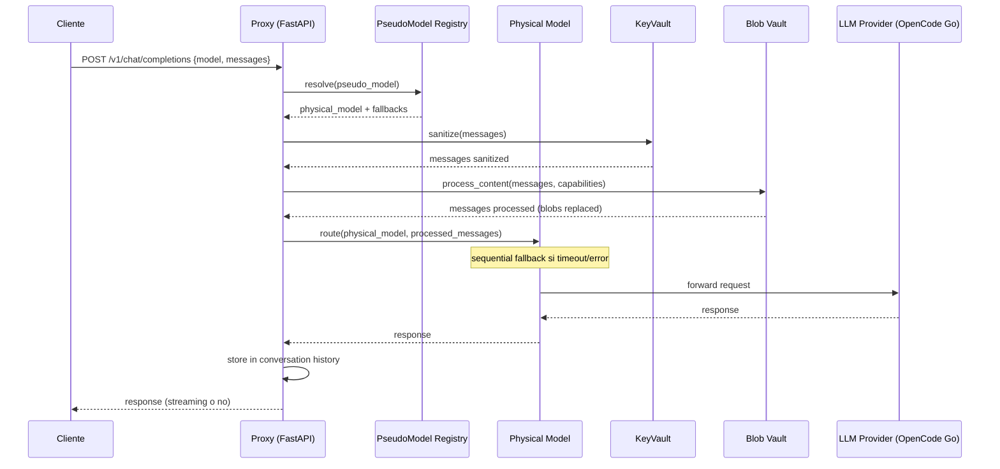
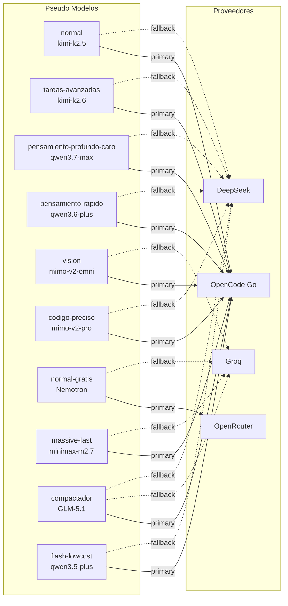
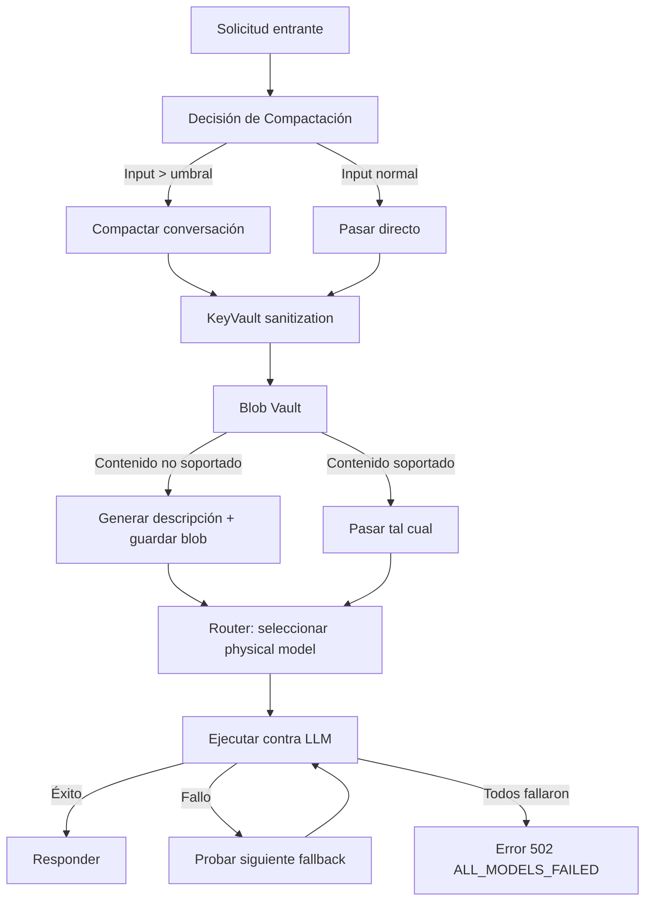
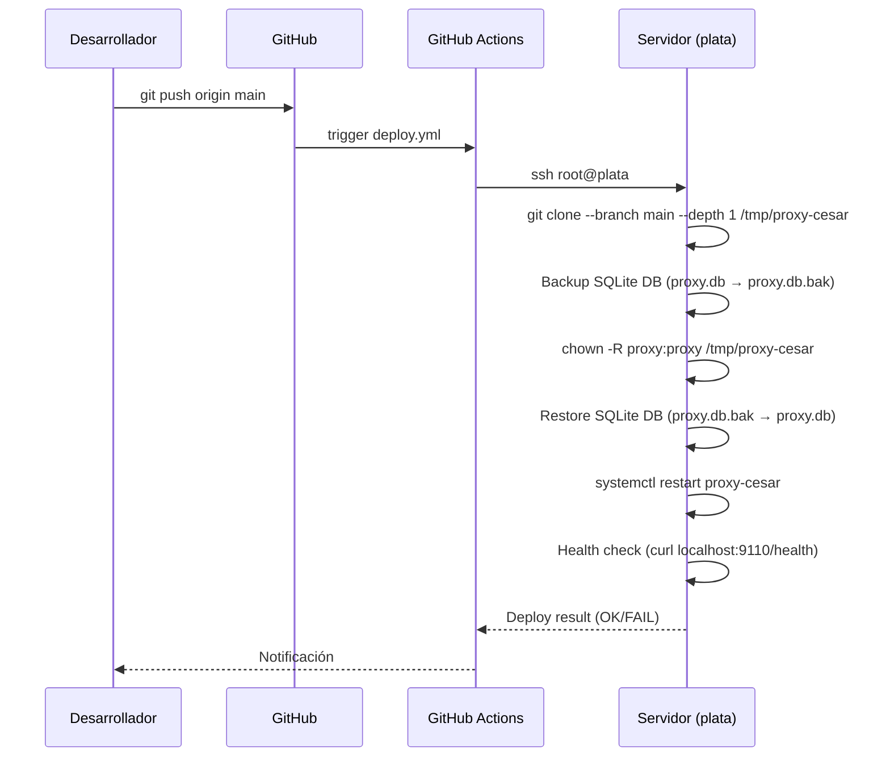

# Diagramas de Arquitectura — proxy-cesar

> **Advertencia:** Reflejan el estado actual (Mayo 2026). Si el código cambia, actualiza este documento.

---

## 1. Flujo de Solicitud Chat



---

## 2. Arquitectura de Despliegue

```mermaid
graph TB
    subgraph GitHub
        A[push a main]
        B[GitHub Actions deploy.yml]
    end

    subgraph Servidor "plata"
        C[git clone --depth 1]
        D[chown -R proxy:proxy]
        E[Backup/Restore SQLite DB]
        F[systemctl restart proxy-cesar]
        G[Health Check POST-Deploy]
    end

    subgraph Servicios
        H[Caddy reverse proxy :443]
        I[proxy-cesar.service<br/>FastAPI :9110]
        J[Redis nativo :6380<br/>systemd redis-6380]
        K[deepbde-redis Docker :6379]
        L[chemistry-apps Docker :8080, :4210]
        M[PostgreSQL 14 :5432<br/>NO usado por proxy]
    end

    A --> B
    B --> C
    C --> D
    D --> E
    E --> F
    F --> G
    G -.->|OK| H
    H -->|chat.guzman-lopez.com| I
    I --> J
    I -.->|No depende| K
    I -.->|No depende| L
    I -.->|No depende| M
```

---

## 3. Pseudo-Modelos → Physical Models



**Physical models clave:**
- `openai/kimi-k2.5` → normal
- `openai/kimi-k2.6` → tareas-avanzadas
- `anthropic/qwen3.7-max` → pensamiento-profundo-caro (usa endpoint Anthropic de Go)
- `openai/mimo-v2-omni` → vision
- `openai/mimo-v2-pro` → codigo-preciso
- `openai/minimax-m2.7` → massive-fast
- `openai/qwen3.5-plus` → flash-lowcost
- `openai/qwen3.6-plus` → pensamiento-rapido
- `openai/glm-5.1` → compactador
- `openrouter/nvidia/nemotron-3-super-120b-a12b:free` → normal-gratis
- `deepseek/deepseek-v4-pro`, `deepseek/deepseek-v4-flash` → fallbacks

---

## 4. Capas de Procesamiento



---

## 5. Diagrama de Paquetes (Hexagonal)

```mermaid
graph TB
    subgraph "Dominio (core)"
        DM[Domain Models<br/>PseudoModel, PhysicalModel,<br/>Conversation, Message]
        SRVC[Services<br/>chat_service.py → chat_fallback.py<br/>chat_persistence.py, chat_messages.py<br/>CompactService, PseudoModelRegistry]
        PORTS[Ports<br/>ICache, IDatabase, IAuditLog,<br/>ILLMProvider]
    end

    subgraph "Aplicación (API)"
        API[FastAPI Router<br/>chat.py → chat_streaming.py<br/>chat_stream_persistence.py<br/>conversations.py + conversation_operations.py<br/>/health /metrics]
        MIDD[Middleware<br/>KeyVault, BlobVault,<br/>AuditLog, Metrics]
    end

    subgraph "Adaptadores (Infra)"
        CACHE[Cache Adapter<br/>Valkey/Redis :6380]
        DB[Database Adapter<br/>SQLite (archivo)]
        LLM[LLM Provider Adapter<br/>OpenCode Go, OpenRouter, Groq<br/>vía HTTP]
        AUDIT[Audit Adapter<br/>Base de datos]
    end

    API --> MIDD
    MIDD --> SRVC
    SRVC --> DM
    SRVC --> PORTS
    PORTS --> CACHE
    PORTS --> DB
    PORTS --> LLM
    PORTS --> AUDIT
```

---

## 6. Flujo de Despliegue Continuo (CI/CD)



> **Nota:** El deploy corre como `root`, el servicio corre como `proxy`. El `chown` post-clone es crítico. La DB se preserva entre deploys.

---

## 7. Puertos en el Servidor

| Puerto | Servicio | Propietario | Proxy-related |
|--------|----------|-------------|---------------|
| 443 | HTTPS (Caddy) | Caddy | Sí (→ :9110) |
| 9110 | proxy-cesar FastAPI | proxy | **Sí** |
| 6380 | Redis nativo | proxy | **Sí** |
| 6379 | Redis Docker (deepbde) | root | No |
| 5432 | PostgreSQL 14 | postgres | No |
| 8080 | chemistry-apps (Docker) | root | No |
| 4210 | chemistry-apps API (Docker) | root | No |
| 8000 | deepbde-backend (Docker) | root | No |
| 22 | SSH | root | No |

---

## 8. Blob Description Cache

Las descripciones de imágenes/audio/PDF generadas por el Blob Vault se
almacenan en Redis (Valkey) con una clave compuesta:

```
{prefix}:{content_hash}:desc:{prompt_hash}
```

- `content_hash` — hash SHA-256 de 8 caracteres del contenido binario
- `prompt_hash` — hash SHA-256 de 8 caracteres del texto del mensaje del usuario

Esto permite que una misma imagen reciba descripciones distintas según el
contexto del prompt en que se envía, mejorando la calidad de las respuestas
sin recalcular descripciones idénticas para prompts repetidos. Ver
`src/service/tool_detector.py:396` para la implementación.
