# Diagramas del Proxy LLM Multi-Modelo Determinista

## 1. Diagrama de Arquitectura de Componentes

```mermaid
graph TB
    subgraph Clientes["Clientes"]
        A1[OpenCode]
        A2[Continue]
        A3[LibreChat]
        A4[Aider]
        A5[curl / HTTP]
    end

    subgraph Proxy["Proxy César :9110"]
        direction TB
        
        subgraph Middleware["Middleware (CORS→Auth→RateLimit→KeyVault)"]
            direction LR
            M1["CORS"] --> M2["Auth<br/>Bearer Token"] --> M3["RateLimit<br/>Valkey fixed-window"] --> M4["KeyVault<br/>Detecta secrets<br/>Reinyecta en respuesta"]
        end

        subgraph API["API Layer"]
            R1["POST /v1/chat/completions"]
            R2["GET /v1/models"]
            R3["GET /health"]
            R4["GET /conversations/{id}"]
            R5["GET /conversations/{id}/compatible-models"]
            R6["GET /conversations/{id}/tools-compatibility"]
            R7["POST /conversations/{id}/normalize-tools"]
            R8["POST /conversations/{id}/compact"]
            R9["GET /conversations/{id}/audit-log"]
        end

        subgraph Service["Service Layer"]
            S1[Model Resolver]
            S2[Capability Detector]
            S3[Compatibility Validator]
            S4[Tool Filter]
            S5[Tool Detector<br/>Delegación imagen→tool]
            S6[Compactor<br/>POST /compact]
            S7[Router LLM Suggester]
        end

        subgraph Adapters["Adapters Layer"]
            A7[LiteLLM Client]
            A8[Provider Cache]
            A9[Valkey Affinity]
            A10[Local Discovery]
        end

        subgraph Config["Configuration"]
            C1[pseudo_models.yaml]
            C2[.env / Settings]
        end
    end

    subgraph KeyClaw["KeyClaw :8877"]
        KC["MITM Proxy<br/>Filtra API keys<br/>del tráfico saliente"]
    end

    subgraph Proveedores["LLM Providers"]
        P1[DeepSeek]
        P2[Groq]
        P3[OpenRouter]
        P4[Pruna]
        P5[Ollama]
        P6[LM Studio]
    end

    subgraph Almacenamiento["Storage"]
        D1[(SQLite/PostgreSQL<br/>Conversaciones)]
        D2[(Valkey<br/>Caché + Rate Limit)]
    end

    Clientes --> M1
    M3 --> API
    
    API --> Service
    Service --> Adapters
    Service --> Config
    Adapters --> KeyClaw
    KeyClaw --> Proveedores
    Adapters --> Almacenamiento
```

## 1b. Pipeline de Middleware

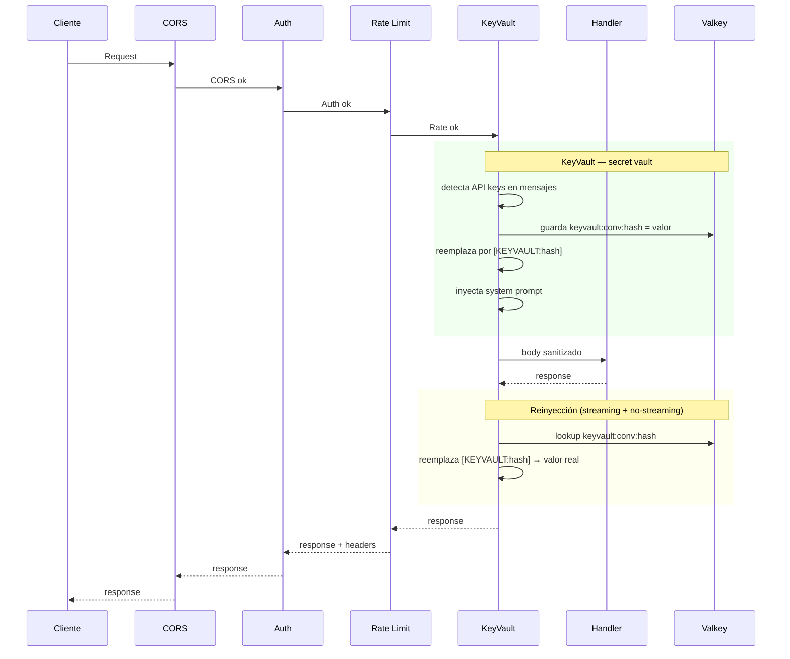

## 1c. KeyVault — Flujo de Secrets

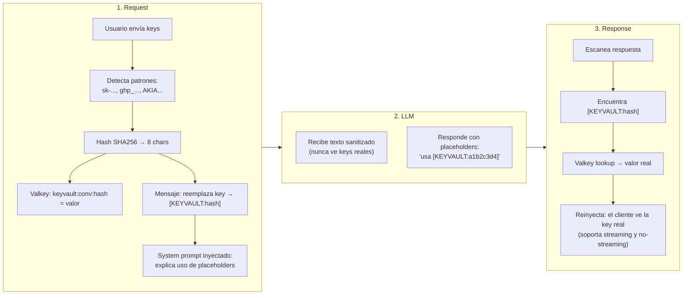

---

## 2. Diagrama de Flujo del Sistema (Chat Completions)

```mermaid
flowchart TB
    Start(["POST /v1/chat/completions"]) --> Auth{¿Auth habilitada?}
    Auth -->|No token| AuthFail[401 Unauthorized]
    Auth -->|Token válido| Rate{¿Rate limit excedido?}
    Rate -->|Sí| RateFail[429 Too Many Requests]
    Rate -->|No| ModelResolve[1. Resolver nombre del modelo]
    
    ModelResolve --> Normalize[nomalize_model_name]
    Normalize --> IsPseudo{¿Es pseudo-modelo<br/>conocido?}
    IsPseudo -->|Sí| Steps[Continuar flujo normal]
    IsPseudo -->|No| Passthrough[Passthrough directo<br/>modelo local/desconocido]
    
    Passthrough --> CapDetect
    Steps --> CapDetect[2. Detectar capacidades del turno]
    CapDetect --> ContentValid[3. Validar contenido entrante]
    
    ContentValid --> HasImages{¿Tiene imágenes?}
    HasImages -->|Sí, sin visión| BlobVaultImg[Blob Vault:<br/>guardar + describir + referencia]
    HasImages -->|Sí, con visión| InlineCmd
    HasImages -->|No| InlineCmd
    
    BlobVaultImg --> InlineCmd
    
    ContentValid --> HasAudio{¿Tiene audio?}
    HasAudio -->|Sí, sin audio model| BlobVaultAud[Blob Vault:<br/>guardar + describir + referencia]
    HasAudio -->|Sí, con audio model| InlineCmd
    
    BlobVaultAud --> InlineCmd
    
    ContentValid --> HasVideo{¿Tiene video?}
    HasVideo -->|Sí| BlobVaultVid[Blob Vault:<br/>guardar + metadata]
    
    BlobVaultVid --> InlineCmd
    
    InlineCmd[4. Verificar comando inline] --> IsCmd{¿status o help?}
    IsCmd -->|Sí| CmdHandled{skip_llm?}
    CmdHandled -->|Sí| CmdResponse[Responder con resultado<br/>del comando]
    CmdHandled -->|No| SessionLoad
    IsCmd -->|No| SessionLoad
    
    SessionLoad[5. Cargar sesión y conversación] --> Affinity[6. Resolver afinidad<br/>modelo físico]
    Affinity --> SwitchValid[7. Validar cambio de<br/>pseudo-modelo]
    
    SwitchValid --> SwitchResult{Resultado}
    SwitchResult -->|BLOCKED| SwitchBlock[409 PSEUDO_MODEL_INCOMPATIBLE<br/>Usa modelo con visión vía tools]
    SwitchResult -->|WARNING| StoreWarn[Guardar warning]
    SwitchResult -->|SAFE| ToolFilter
    
    StoreWarn --> ToolFilter[8. Filtrar modelos por<br/>parallel_tools]
    ToolFilter --> PhysicalResolve[9. Resolver modelo físico<br/>afinidad → primero elegible]
    
    PhysicalResolve --> IsNew{¿Es nueva<br/>conversación?}
    IsNew -->|Sí| CreateConv[Crear en DB]
    IsNew -->|No| ThresholdCheck
    CreateConv --> ThresholdCheck
    
    ThresholdCheck[10. Verificar umbral<br/>de tokens] --> IsOver{¿input > threshold?}
    IsOver -->|Sí| Threshold400[400 INPUT_EXCEEDS_THRESHOLD<br/>Usa POST /compact]
    IsOver -->|No| RouterLLM
    
    RouterLLM[11. Router LLM<br/>sugerencia de downgrade] --> IsRouter{¿Router LLM<br/>habilitado?}
    IsRouter -->|Sí| EvalComplexity[Evaluar complejidad<br/>vía LLM evaluador]
    IsRouter -->|No| LLMCall
    
    EvalComplexity --> IsSuggest{¿Sugiere downgrade?}
    IsSuggest -->|Sí| StoreSuggestion[Guardar sugerencia<br/>nunca bloquea]
    IsSuggest -->|No| LLMCall
    StoreSuggestion --> LLMCall
    
    LLMCall[12. Llamar modelo físico<br/>con fallback] --> ForEach[Por cada modelo físico<br/>en orden de prioridad]
    
    ForEach --> CheckCtx{¿input ><br/>context_window?}
    CheckCtx -->|Sí| SkipModel[Saltar - CONTEXT_SKIPPED]
    CheckCtx -->|No| CacheOpt[Optimizar caché<br/>si Anthropic/DeepSeek]
    
    CacheOpt --> LiteLLMCall[call_litellm]
    LiteLLMCall --> IsError{¿Error retryable?}
    IsError -->|Sí| Fallback[Registrar fallback<br/>→ siguiente modelo]
    IsError -->|No| Success[Respuesta exitosa]
    
    Fallback --> NextModel{¿Quedan modelos?}
    NextModel -->|Sí| CheckCtx
    NextModel -->|No| AllFailed{¿Todos saltados<br/>por contexto?}
    AllFailed -->|Sí| Context413[413 CONTEXT_TOO_LARGE]
    AllFailed -->|No| Models503[503 ALL_MODELS_FAILED]
    
    Success --> SaveTurn[13. Guardar turno en DB]
    SaveTurn --> AccumCaps[Acumular capacidades]
    AccumCaps --> Commit[Commit DB]
    Commit --> Response["14. Responder al cliente<br/>+ proxy_metadata"]
    
    Response --> StreamQ{¿Streaming?}
    StreamQ -->|Sí| SSE[Streaming SSE<br/>+ metadata final]
    StreamQ -->|No| JSON[Respuesta JSON<br/>completa]
```

---

## 3. Diagrama de Estados del Pseudo-Modelo y Modelo Físico

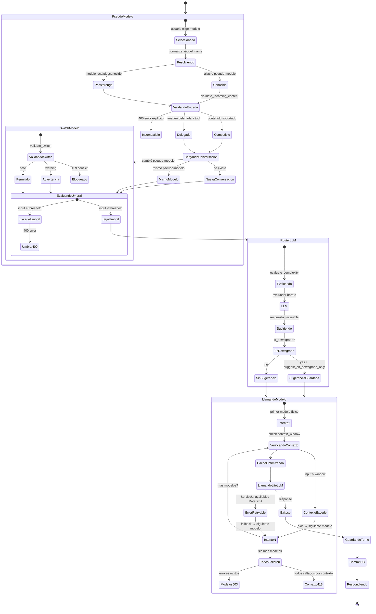

---

## 4. Diagrama de Secuencia (Flujo Completo de una Solicitud)

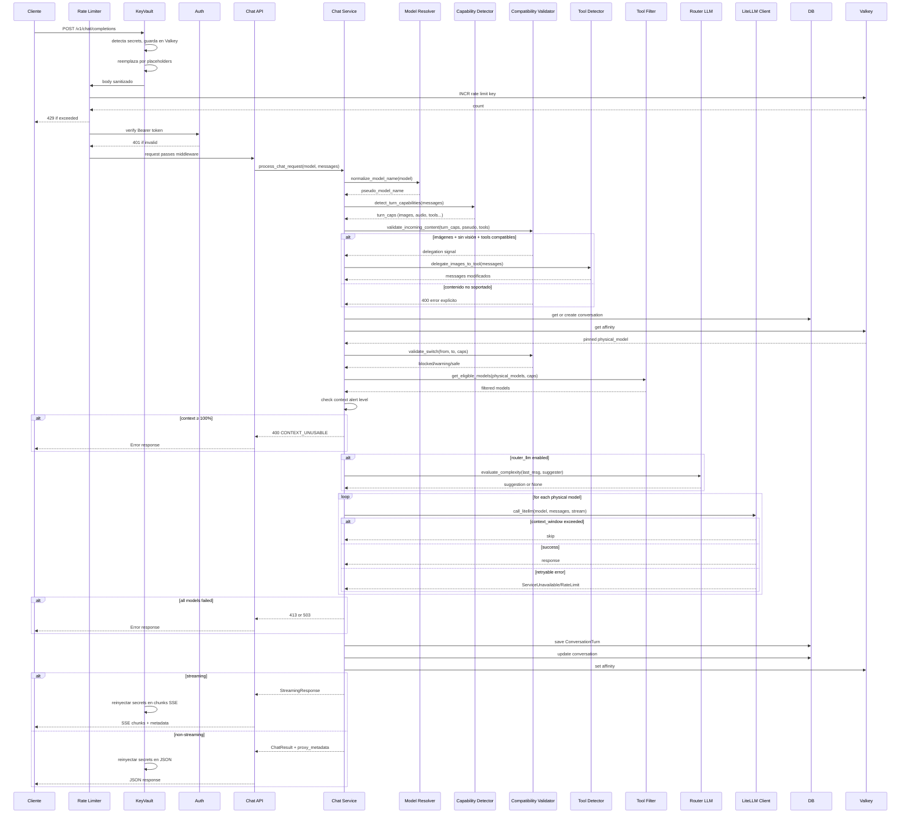

---

## 5. Diagrama de Casos de Uso del Usuario

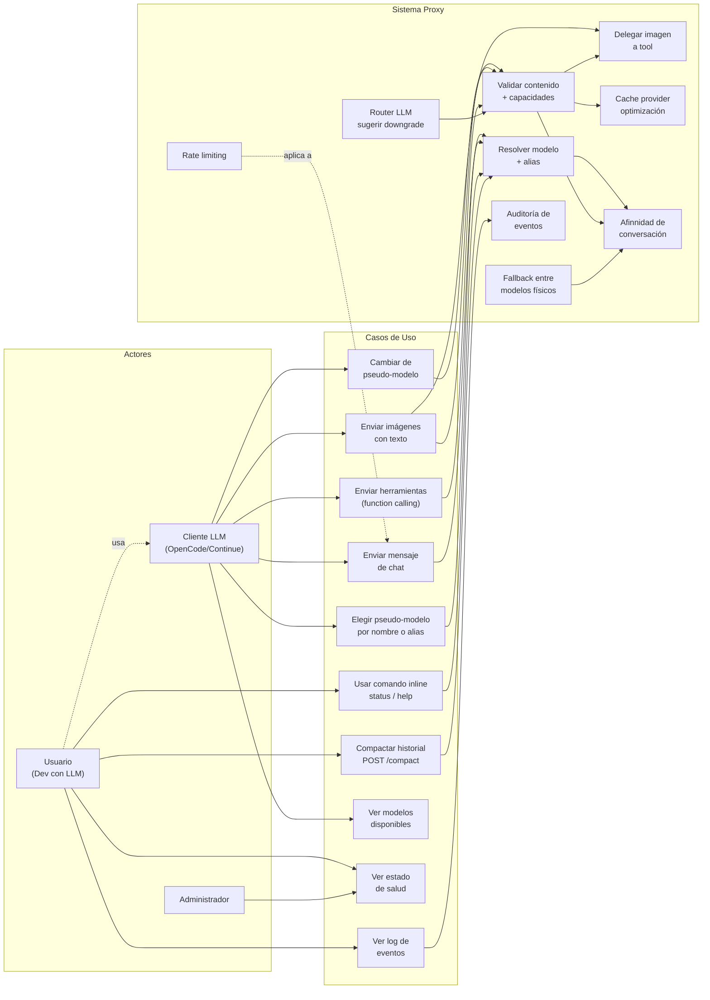

---

## 6. Diagrama de Eventos del Sistema

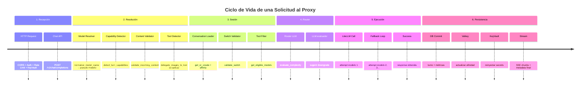

---

## 7. Diagrama de Decisión de Estrategia de Cache

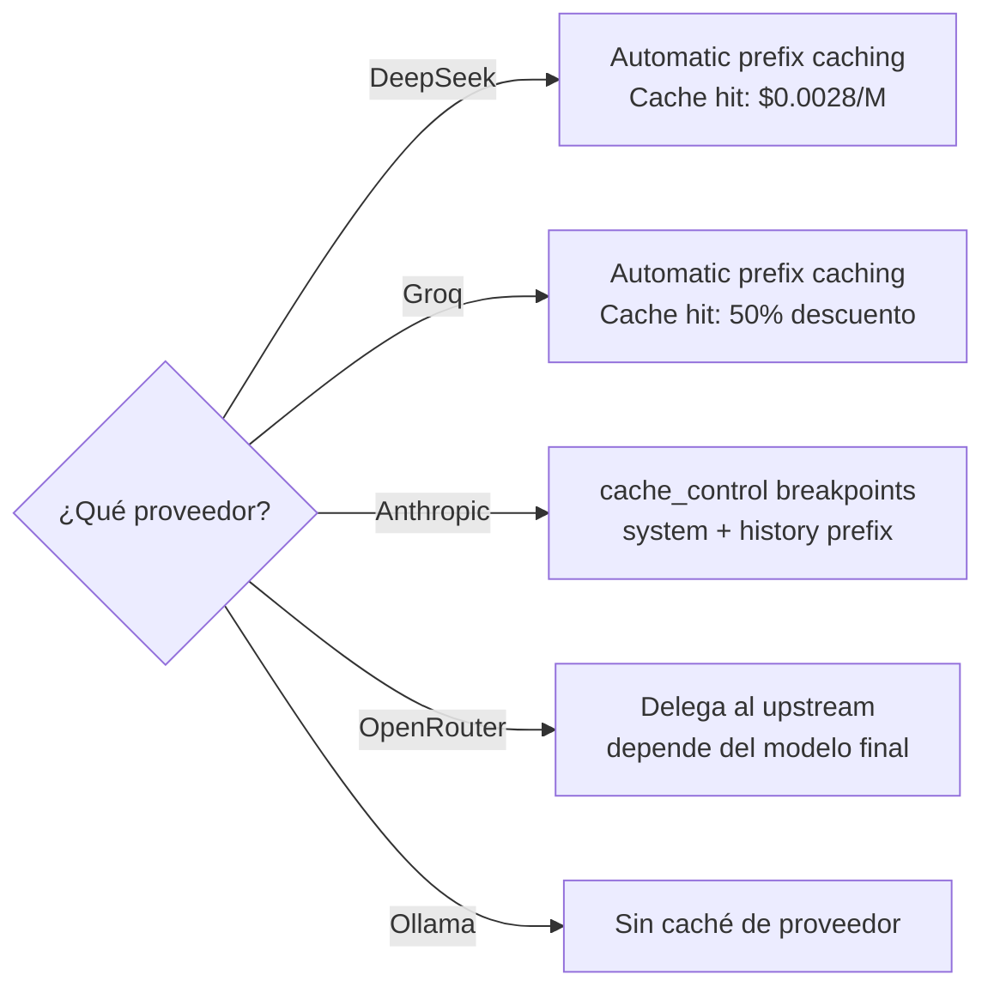

---

## 8. Diagrama de Relación Pseudo-Modelos a Modelos Físicos

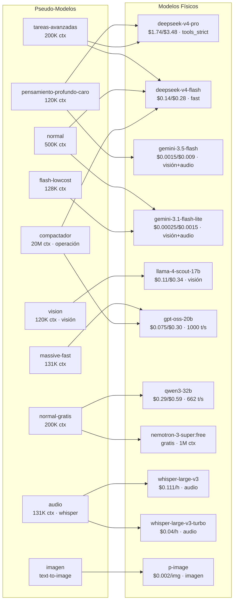

---

## 9. Diagrama de Flujo del Router LLM

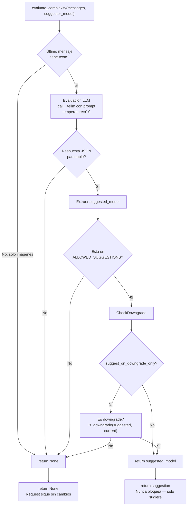

---

## 10. Mapa de Errores del Sistema

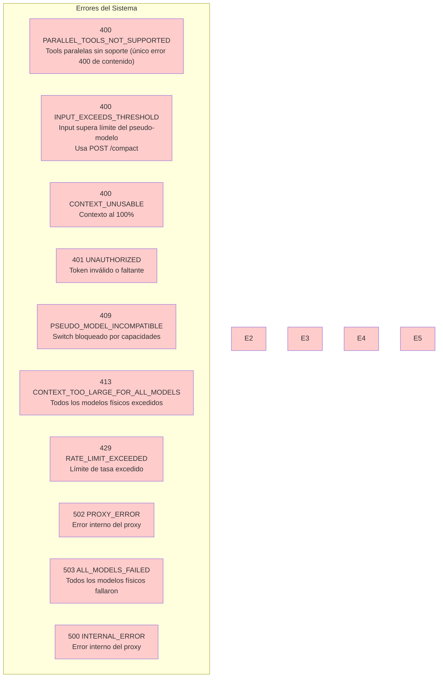

---

## Leyenda de Colores

| Color | Significado |
|-------|------------|
| Azul | Componente del sistema |
| Verde | Flujo exitoso |
| Rojo | Error / Bloqueo |
| Amarillo | Advertencia / Decisión |
