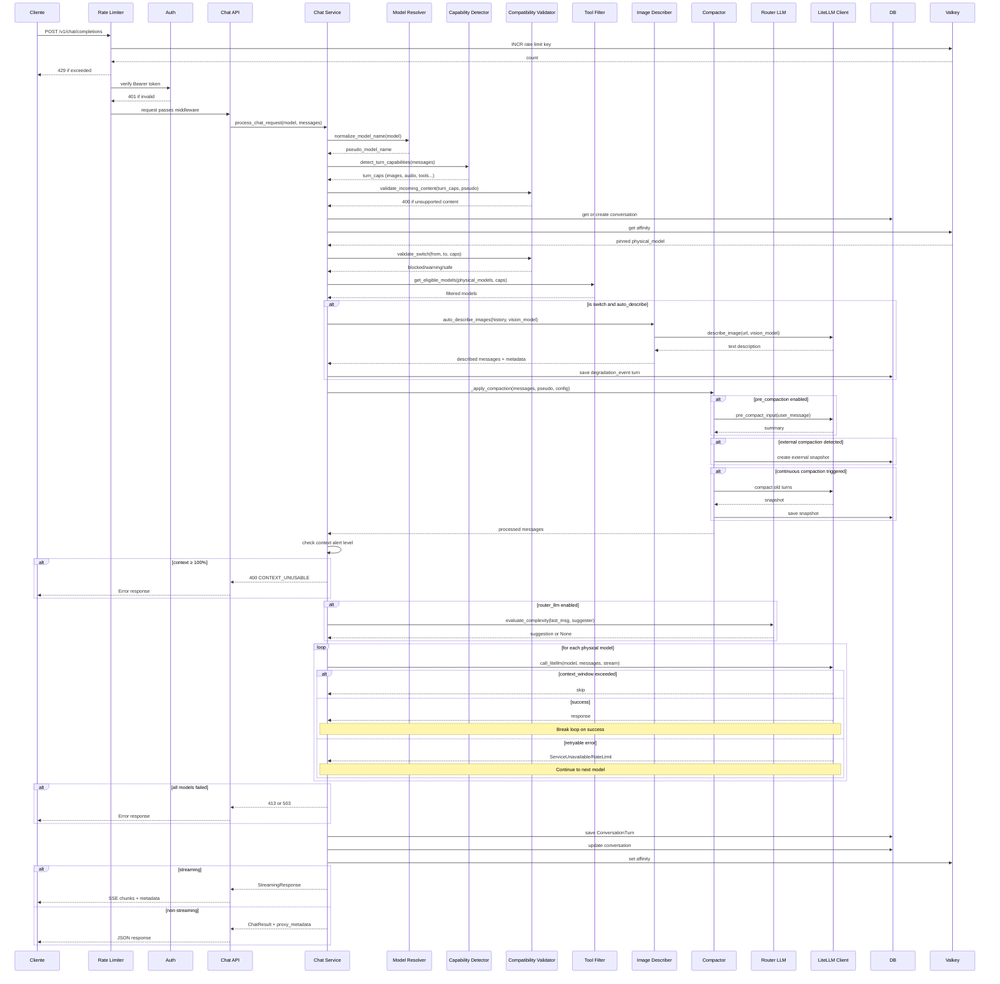
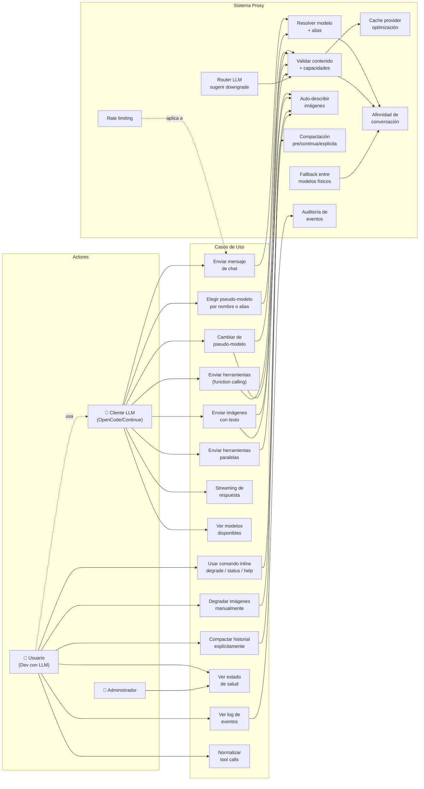
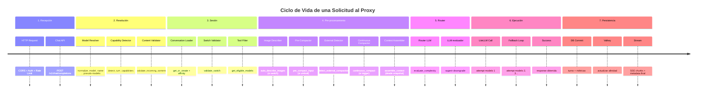
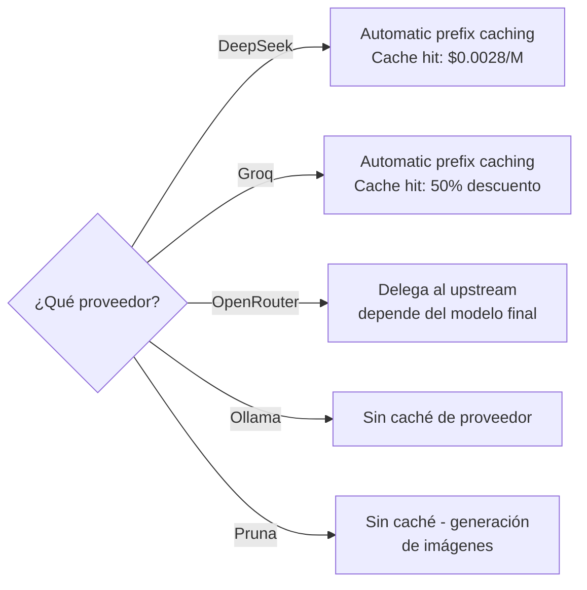
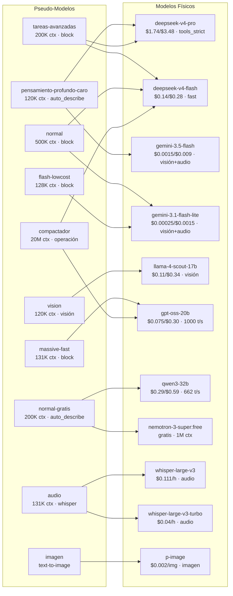
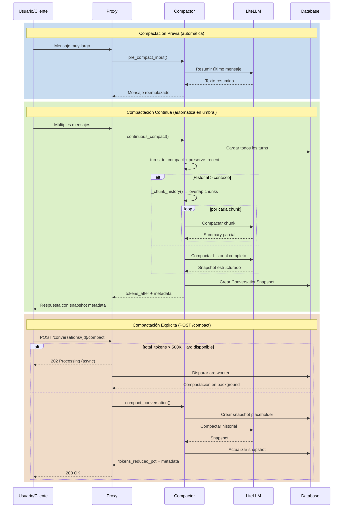
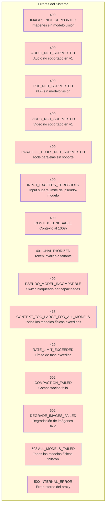

# Diagramas del Proxy LLM Multi-Modelo Determinista

## 1. Diagrama de Arquitectura de Componentes

```mermaid
graph TB
    subgraph Clientes["Clientes"]
        A1[OpenCode]
        A2[Continue]
        A3[LibreChat]
        A4[Aider]
        A5[curl / HTTP]
    end

    subgraph Proxy["Proxy César"]
        direction TB
        
        subgraph Middleware["Middleware Layer"]
            M1[CORS]
            M2[Auth - Bearer Token]
            M3[Rate Limiter - Valkey]
        end

        subgraph API["API Layer"]
            R1["POST /v1/chat/completions"]
            R2["GET /v1/models"]
            R3["GET /health"]
            R4["GET /conversations/{id}"]
            R5["GET /conversations/{id}/compatible-models"]
            R6["GET /conversations/{id}/tools-compatibility"]
            R7["POST /conversations/{id}/normalize-tools"]
            R8["POST /conversations/{id}/compact"]
            R9["GET /conversations/{id}/audit-log"]
            R10["POST /conversations/{id}/degrade-images"]
        end

        subgraph Service["Service Layer"]
            S1[Model Resolver]
            S2[Capability Detector]
            S3[Compatibility Validator]
            S4[Tool Filter]
            S5[Image Describer]
            S6[Compactor]
            S7[Router LLM Suggester]
        end

        subgraph Adapters["Adapters Layer"]
            A7[LiteLLM Client]
            A8[Provider Cache]
            A9[Valkey Affinity]
            A10[Local Discovery]
        end

        subgraph Config["Configuration"]
            C1[pseudo_models.yaml]
            C2[.env / Settings]
        end
    end

    subgraph Proveedores["LLM Providers"]
        P1[DeepSeek]
        P2[Groq]
        P3[OpenRouter]
        P4[Pruna - Imagen]
        P5[Ollama - Local]
        P6[LM Studio - Local]
    end

    subgraph Almacenamiento["Storage"]
        D1[(SQLite/PostgreSQL<br/>Conversaciones)]
        D2[(Valkey<br/>Caché + Rate Limit)]
    end

    Clientes --> M1
    M1 --> M2
    M2 --> M3
    M3 --> API
    
    API --> Service
    Service --> Adapters
    Service --> Config
    Adapters --> Proveedores
    Adapters --> Almacenamiento
```



---

## 2. Diagrama de Flujo del Sistema (Chat Completions)

```mermaid
flowchart TB
    Start(["POST /v1/chat/completions"]) --> Auth{¿Auth habilitada?}
    Auth -->|No token| AuthFail[401 Unauthorized]
    Auth -->|Token válido| Rate{¿Rate limit excedido?}
    Rate -->|Sí| RateFail[429 Too Many Requests]
    Rate -->|No| ModelResolve[1. Resolver nombre del modelo]
    
    ModelResolve --> Normalize[nomalize_model_name]
    Normalize --> IsPseudo{¿Es pseudo-modelo<br/>conocido?}
    IsPseudo -->|Sí| Steps[Continuar flujo normal]
    IsPseudo -->|No| Passthrough[build_passthrough_pseudo_model<br/>Crear pseudo-modelo mínimo]
    
    Passthrough --> CapDetect
    Steps --> CapDetect[2. Detectar capacidades del turno]
    CapDetect --> ContentValid[3. Validar contenido entrante]
    
    ContentValid --> HasImages{¿Tiene imágenes?}
    HasImages -->|Sí, sin visión| Images400[400 IMAGES_NOT_SUPPORTED]
    HasImages -->|Sí, con visión| InlineCmd
    HasImages -->|No| InlineCmd
    
    ContentValid --> HasAudio{¿Tiene audio?}
    HasAudio -->|Sí| Audio400[400 AUDIO_NOT_SUPPORTED]
    
    ContentValid --> HasVideo{¿Tiene video?}
    HasVideo -->|Sí| Video400[400 VIDEO_NOT_SUPPORTED]
    
    ContentValid --> HasPDF{¿Tiene PDF sin visión?}
    HasPDF -->|Sí| PDF400[400 PDF_NOT_SUPPORTED]
    
    InlineCmd[4. Verificar comando inline] --> IsCmd{¿degrade, status<br/>o help?}
    IsCmd -->|Sí| CmdHandled{skip_llm?}
    CmdHandled -->|Sí| CmdResponse[Responder con resultado<br/>del comando]
    CmdHandled -->|No| SessionLoad
    IsCmd -->|No| SessionLoad
    
    SessionLoad[5. Cargar sesión y conversación] --> Affinity[6. Resolver afinidad<br/>modelo físico]
    Affinity --> SwitchValid[7. Validar cambio de<br/>pseudo-modelo]
    
    SwitchValid --> SwitchResult{Resultado}
    SwitchResult -->|BLOCKED| SwitchBlock[409 PSEUDO_MODEL_INCOMPATIBLE]
    SwitchResult -->|WARNING| StoreWarn[Guardar warning]
    SwitchResult -->|SAFE| ToolFilter
    
    StoreWarn --> ToolFilter[8. Filtrar modelos por<br/>parallel_tools]
    ToolFilter --> PhysicalResolve[9. Resolver modelo físico<br/>afinidad → primero elegible]
    
    PhysicalResolve --> IsNew{¿Es nueva<br/>conversación?}
    IsNew -->|Sí| CreateConv[Crear en DB]
    IsNew -->|No| IsSwitch{¿Cambió pseudo-modelo?}
    
    IsSwitch -->|Sí| AutoDescribe[10. Auto-describir imágenes]
    IsSwitch -->|No| ThresholdCheck
    CreateConv --> ThresholdCheck
    
    AutoDescribe --> TargetVision{¿Destino tiene<br/>visión?}
    TargetVision -->|Sí| PassThrough[Pasar imágenes<br/>sin describir]
    TargetVision -->|No, auto_describe| DescribeImages[Describir imágenes<br/>con modelo visión]
    TargetVision -->|No, block| ImageBlocked[409 BLOCKED]
    
    DescribeImages --> ThresholdCheck
    PassThrough --> ThresholdCheck
    
    ThresholdCheck[11. Verificar umbral<br/>de tokens] --> IsOver{¿input > threshold?}
    IsOver -->|Sí| Threshold400[400 INPUT_EXCEEDS_THRESHOLD]
    IsOver -->|No| PreCompact[12. Pre-compactación]
    
    PreCompact --> PreCheck{¿Habilitada y<br/>input > umbral?}
    PreCheck -->|Sí| PreCompactExec[Resumir último<br/>mensaje de usuario]
    PreCheck -->|No| ExternalDetect
    
    PreCompactExec --> ExternalDetect[13. Detectar compactación<br/>externa del cliente]
    
    ExternalDetect --> IsExternal{¿Cliente compactó<br/>historial?}
    IsExternal -->|Sí| HandleExternal[Crear snapshot external<br/>resetear total_tokens]
    IsExternal -->|No| ContinousCheck
    
    HandleExternal --> ContinousCheck[14. Compactación continua]
    
    ContinousCheck --> IsTrigger{¿total_tokens ><br/>ctx_window × trigger_pct?}
    IsTrigger -->|Sí| ContinousExec[Compactar turns antiguos<br/>→ ConversaciónSnapshot]
    IsTrigger -->|No| SnapshotCheck
    
    ContinousExec --> SnapshotCheck[15. Ensamblar contexto<br/>desde snapshot]
    
    SnapshotCheck --> HasSnapshot{¿Hay snapshot<br/>activo?}
    HasSnapshot -->|Sí| AssembleContext[Armar: snapshot<br/>+ últimos mensajes]
    HasSnapshot -->|No| ReEstimate[Usar mensajes originales]
    
    AssembleContext --> ReEstimate
    ReEstimate --> AlertCheck[16. Alerta de contexto]
    
    AlertCheck --> UsagePct{¿Porcentaje de<br/>contexto usado?}
    UsagePct -->|≥100%| Context400[400 CONTEXT_UNUSABLE]
    UsagePct -->|80-99%| HighAlert[Alta: Compact recommended]
    UsagePct -->|60-80%| ModerateAlert[Moderada: advertencia]
    UsagePct -->|<60%| RouterLLM
    
    HighAlert --> RouterLLM[17. Router LLM<br/>sugerencia de downgrade]
    ModerateAlert --> RouterLLM
    Context400 -.-> End

    RouterLLM --> IsRouter{¿Router LLM<br/>habilitado?}
    IsRouter -->|Sí| EvalComplexity[Evaluar complejidad<br/>vía LLM evaluador]
    IsRouter -->|No| LLMCall
    
    EvalComplexity --> IsSuggest{¿Sugiere downgrade?}
    IsSuggest -->|Sí| StoreSuggestion[Guardar sugerencia]
    IsSuggest -->|No| LLMCall
    StoreSuggestion --> LLMCall
    
    LLMCall[18. Llamar modelo físico<br/>con fallback] --> ForEach[Por cada modelo físico<br/>en orden de prioridad]
    
    ForEach --> CheckCtx{¿input ><br/>context_window?}
    CheckCtx -->|Sí| SkipModel[Saltar - CONTEXT_SKIPPED]
    CheckCtx -->|No| CacheOpt[Optimizar caché<br/>si Anthropic]
    
    CacheOpt --> LiteLLMCall[call_litellm]
    LiteLLMCall --> IsError{¿Error retryable?}
    IsError -->|Sí| Fallback[Registrar fallback<br/>→ siguiente modelo]
    IsError -->|No| Success[✅ Respuesta exitosa]
    
    Fallback --> NextModel{¿Quedan modelos?}
    NextModel -->|Sí| CheckCtx
    NextModel -->|No| AllFailed{¿Todos saltados<br/>por contexto?}
    AllFailed -->|Sí| Context413[413 CONTEXT_TOO_LARGE]
    AllFailed -->|No| Models503[503 ALL_MODELS_FAILED]
    
    Success --> SaveTurn[19. Guardar turno en DB]
    SaveTurn --> AccumCaps[Acumular capacidades]
    AccumCaps --> Commit[Commit DB]
    Commit --> Response["20. Responder al cliente<br/>+ proxy_metadata"]
    
    Response --> StreamQ{¿Streaming?}
    StreamQ -->|Sí| SSE[Streaming SSE<br/>+ metadata final]
    StreamQ -->|No| JSON[Respuesta JSON<br/>completa]

    subgraph Leyenda
        L1["🟢 Flujo normal"]
        L2["🔴 Error / Bloqueo"]
        L3["🟡 Advertencia"]
    end
```



---

## 3. Diagrama de Estados del Pseudo-Modelo y Modelo Físico

```mermaid
stateDiagram-v2
    [*] --> PseudoModelo
    
    state PseudoModelo {
        [*] --> Seleccionado: usuario elige modelo
        Seleccionado --> Resolviendo: normalize_model_name
        Resolviendo --> Conocido: alias o pseudo-modelo
        Resolviendo --> Passthrough: modelo local/desconocido
        Conocido --> ValidandoEntrada: validate_incoming_content
        Passthrough --> ValidandoEntrada
        ValidandoEntrada --> Compatible: contenido soportado
        ValidandoEntrada --> Incompatible: 400 error
        Compatible --> CargandoConversacion
        CargandoConversacion --> NuevaConversacion: no existe
        CargandoConversacion --> SwitchModelo: cambió pseudo-modelo
        CargandoConversacion --> MismoModelo: mismo pseudo-modelo
        NuevaConversacion --> EvaluandoUmbral
        MismoModelo --> EvaluandoUmbral
    }
    
    state SwitchModelo {
        [*] --> ValidandoSwitch: validate_switch
        ValidandoSwitch --> Bloqueado: 409 conflict
        ValidandoSwitch --> Advertencia: warning
        ValidandoSwitch --> Permitido: safe
        Advertencia --> AutoDescribe: images + auto_describe
        Permitido --> AutoDescribe: images + auto_describe
        AutoDescribe --> Describiendo: modelo visión describe imágenes
        Describiendo --> TurnoDegradacion: degradation_event
        TurnoDegradacion --> EvaluandoUmbral
        AutoDescribe --> EvaluandoUmbral: sin imágenes
    }
    
    state EvaluandoUmbral {
        [*] --> BajoUmbral: input ≤ threshold
        [*] --> ExcedeUmbral: input > threshold
        ExcedeUmbral --> PreCompactando: pre_compaction enabled
        ExcedeUmbral --> Umbral400: 400 error
        PreCompactando --> BajoUmbral: compactado exitoso
        PreCompactando --> BajoUmbral: fallback sin compactar
    }
    
    state Compactacion {
        [*] --> DetectandoExterna
        DetectandoExterna --> ExternaDetectada: cliente ya compactó
        DetectandoExterna --> ContinuaCheck: sin compactación externa
        ExternaDetectada --> SnapshotExterno
        ContinuaCheck --> BajoTrigger: tokens < trigger_pct
        ContinuaCheck --> Compactando: tokens ≥ trigger_pct
        Compactando --> SnapshotInterno: snapshot creado
        SnapshotInterno --> EnsamblandoContexto
        SnapshotExterno --> EnsamblandoContexto
        BajoTrigger --> EnsamblandoContexto
        EnsamblandoContexto --> ContextoListo
    }
    
    state LlamandoModelo {
        [*] --> Intento1: primer modelo físico
        Intento1 --> VerificandoContexto: check context_window
        VerificandoContexto --> ContextoExcede: input > window
        VerificandoContexto --> CacheOptimizando
        ContextoExcede --> IntentoN: skip → siguiente modelo
        CacheOptimizando --> LlamandoLiteLLM
        LlamandoLiteLLM --> Exitoso: ✅ response
        LlamandoLiteLLM --> ErrorRetryable: ServiceUnavailable / RateLimit
        ErrorRetryable --> IntentoN: fallback → siguiente modelo
        IntentoN --> VerificandoContexto: más modelos?
        IntentoN --> TodosFallaron: sin más modelos
        TodosFallaron --> Contexto413: todos saltados por contexto
        TodosFallaron --> Modelos503: errores mixtos
    }
    
    BajoUmbral --> Compactacion
    ContextoListo --> RouterLLM
    
    state RouterLLM {
        [*] --> Evaluando: evaluate_complexity
        Evaluando --> LLM: evaluador barato
        LLM --> Sugiriendo: respuesta parseable
        Sugiriendo --> EsDowngrade: is_downgrade?
        EsDowngrade --> SugerenciaGuardada: yes + suggest_on_downgrade_only
        EsDowngrade --> SinSugerencia: no
    }
    
    SugerenciaGuardada --> LlamandoModelo
    SinSugerencia --> LlamandoModelo
    
    Exitoso --> GuardandoTurno
    GuardandoTurno --> CommitDB
    CommitDB --> Respondiendo
    
    Respondiendo --> [*]
```



---

## 4. Diagrama de Secuencia (Flujo Completo de una Solicitud)



---

## 5. Diagrama de Casos de Uso del Usuario



---

## 6. Diagrama de Eventos del Sistema



---

## 7. Diagrama de Decisión de Estrategia de Cache



---

## 8. Diagrama de Relación Pseudo-Modelos a Modelos Físicos



---

## 9. Diagrama de Secuencia de Compactación



---

## 10. Diagrama de Flujo del Router LLM

```mermaid
flowchart TD
    Start["evaluate_complexity(messages, suggester_model)"] --> Safety{¿Último mensaje<br/>tiene texto?}
    Safety -->|No, solo imágenes| ReturnNone[return None]
    Safety -->|Sí| LLMEval[Evaluación LLM<br/>call_litellm con prompt<br/>temperature=0.0]
    
    LLMEval --> LLMResult{¿Respuesta JSON<br/>parseable?}
    LLMResult -->|Sí| ParseSug[Extraer suggested_model]
    LLMResult -->|No| ReturnNone
    
    ParseSug --> IsAllowed{¿Está en<br/>ALLOWED_SUGGESTIONS?}
    IsAllowed -->|Sí| CheckDowngrade
    IsAllowed -->|No| ReturnNone
    
    CheckDowngrade --> SuggestOnly{¿suggest_on_downgrade_only?}
    SuggestOnly -->|Sí| IsDowngrade{¿Es downgrade?<br/>is_downgrade(suggested, current)}
    SuggestOnly -->|No| ReturnSuggestion[return suggested_model]
    
    IsDowngrade -->|Sí| ReturnSuggestion
    IsDowngrade -->|No| ReturnNone
    
    ReturnNone --> End[return None<br/>Request sigue sin cambios]
    ReturnSuggestion --> End2[return suggestion<br/>Nunca bloquea — solo sugiere]
```

---

## 11. Mapa de Errores del Sistema



---

## Leyenda de Colores

| Color | Significado |
|-------|------------|
| 🔵 Azul | Componente del sistema |
| 🟢 Verde | Flujo exitoso |
| 🔴 Rojo | Error / Bloqueo |
| 🟡 Amarillo | Advertencia / Decisión |
| ⚪ Blanco | Actor externo |
