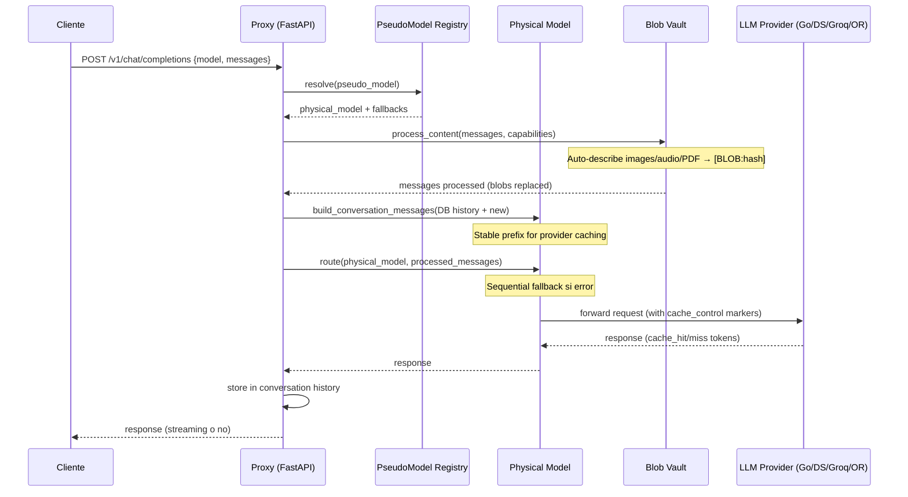
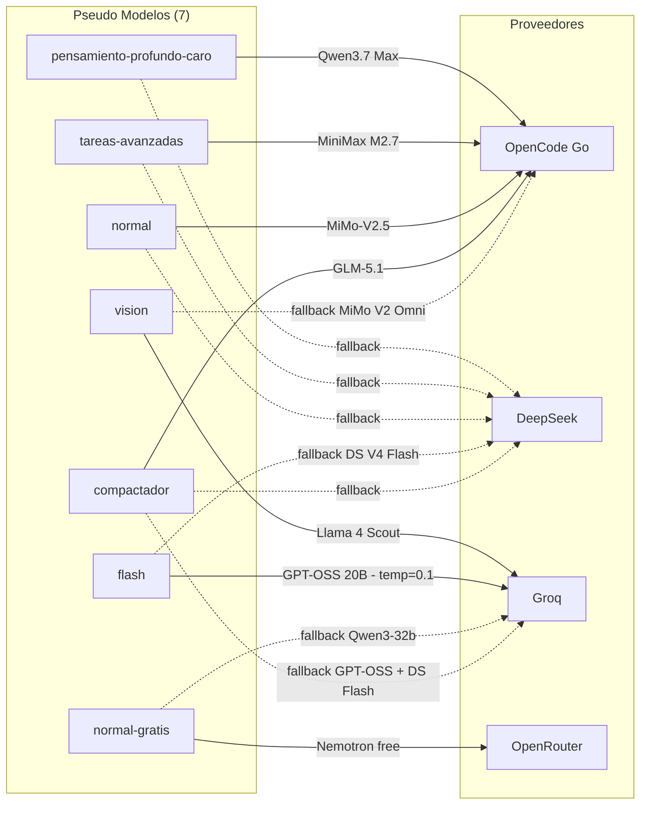
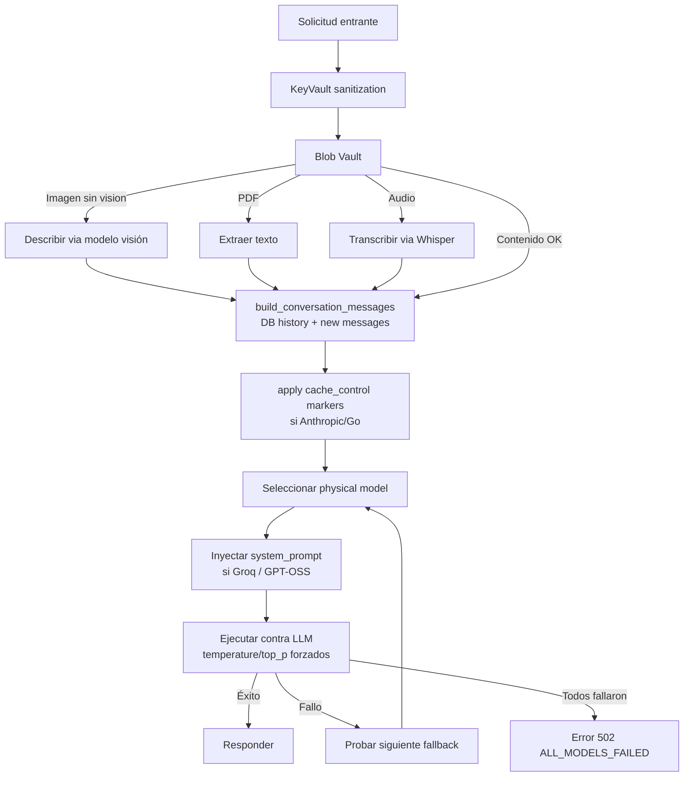
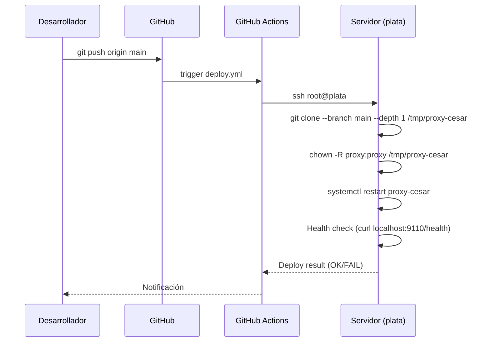
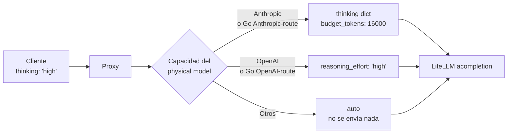

# Diagramas de Arquitectura — proxy-cesar v1.1

> **Advertencia:** Reflejan el estado actual (Mayo 2026). Si el código cambia, actualiza este documento.

---

## 1. Flujo de Solicitud Chat



---

## 2. Arquitectura de Despliegue

```mermaid
graph TB
    subgraph GitHub
        A[push a main]
        B[GitHub Actions deploy.yml]
    end

    subgraph Servidor "plata"
        C[git clone --depth 1]
        D[chown -R proxy:proxy]
        E[Backup/Restore SQLite DB]
        F[systemctl restart proxy-cesar]
        G[Health Check POST-Deploy]
    end

    subgraph Servicios
        H[Caddy reverse proxy :443]
        I[proxy-cesar.service<br/>FastAPI :9110]
        J[Redis nativo :6380<br/>systemd redis-6380]
        K[deepbde-redis Docker :6379]
        L[chemistry-apps Docker :8080, :4210]
        M[PostgreSQL 14 :5432<br/>NO usado por proxy]
    end

    A --> B
    B --> C
    C --> D
    D --> E
    E --> F
    F --> G
    G -.->|OK| H
    H -->|chat.guzman-lopez.com| I
    I --> J
    I -.->|No depende| K
    I -.->|No depende| L
    I -.->|No depende| M
```

---

## 3. Pseudo-Modelos → Physical Models (v1.1)



### Physical models clave (v1.1):
| Provider | Modelo | Pseudo-modelos |
|---|---|---|
| **opencode-go** | `anthropic/qwen3.7-max` | pensamiento-profundo-caro |
| | `anthropic/minimax-m2.7` | tareas-avanzadas |
| | `openai/mimo-v2.5` | **normal** |
| | `openai/mimo-v2-omni` | vision (fallback) |
| | `openai/glm-5.1` | compactador |
| **deepseek** | `deepseek/deepseek-v4-pro` | pensamiento-profundo-caro (fallback) |
| | `deepseek/deepseek-v4-flash` | tareas, normal, flash, compactador |
| **groq** | `groq/openai/gpt-oss-20b` | **flash** (primary), compactador (fallback) |
| | `groq/meta-llama/llama-4-scout-17b-16e-instruct` | vision (primary) |
| | `groq/qwen/qwen3-32b` | normal-gratis (fallback) |
| **openrouter** | `nvidia/nemotron-3-super-120b-a12b:free` | normal-gratis (primary) |

---

## 4. Capas de Procesamiento



---

## 5. Diagrama de Paquetes (Hexagonal)

```mermaid
graph TB
    subgraph "Dominio (core)"
        DM[Domain Models<br/>PseudoModel, PhysicalModel,<br/>Conversation, Message]
        SRVC[Services<br/>chat_service.py → chat_fallback.py<br/>chat_persistence.py, chat_messages.py<br/>CompactService, PseudoModelRegistry]
        PORTS[Ports<br/>ICache, IDatabase, IAuditLog,<br/>ILLMProvider]
    end

    subgraph "Aplicación (API)"
        API[FastAPI Router<br/>chat.py → chat_streaming.py<br/>chat_stream_persistence.py<br/>conversations.py + conversation_operations.py<br/>/health /metrics]
        MIDD[Middleware<br/>KeyVault, BlobVault,<br/>AuditLog, Metrics]
    end

    subgraph "Adaptadores (Infra)"
        CACHE[Cache Adapter<br/>Valkey/Redis :6380]
        DB[Database Adapter<br/>SQLite (archivo)]
        LLM[LLM Provider Adapter<br/>OpenCode Go, OpenRouter, Groq<br/>vía HTTP]
        AUDIT[Audit Adapter<br/>Base de datos]
    end

    API --> MIDD
    MIDD --> SRVC
    SRVC --> DM
    SRVC --> PORTS
    PORTS --> CACHE
    PORTS --> DB
    PORTS --> LLM
    PORTS --> AUDIT
```

---

## 6. Flujo de Despliegue Continuo (CI/CD)



> **Nota:** El deploy corre como `root`, el servicio corre como `proxy`. El `chown` post-clone es crítico. La DB se preserva entre deploys.

---

## 7. Puertos en el Servidor

| Puerto | Servicio | Propietario | Proxy-related |
|--------|----------|-------------|---------------|
| 443 | HTTPS (Caddy) | Caddy | Sí (→ :9110) |
| 9110 | proxy-cesar FastAPI | proxy | **Sí** |
| 6380 | Redis nativo | proxy | **Sí** |
| 6379 | Redis Docker (deepbde) | root | No |
| 5432 | PostgreSQL 14 | postgres | No |
| 8080 | chemistry-apps (Docker) | root | No |
| 4210 | chemistry-apps API (Docker) | root | No |
| 8000 | deepbde-backend (Docker) | root | No |
| 22 | SSH | root | No |

---

## 8. Flujo de Razonamiento (Thinking / Reasoning Effort)



La normalización ocurre en `_normalise_reasoning_param()` dentro de `chat_fallback.py`:
- Cada modelo físico en la cadena de fallback se evalúa individualmente
- Go OpenAI-route models (MiMo, Kimi, GLM, DeepSeek) reciben `reasoning_effort`
- Go Anthropic-route models (Qwen, MiniMax) reciben `thinking` dict

---

## 9. Context Objects (v1.1)

| Clase | Ubicación | Parámetros | Caso de uso |
|---|---|---|---|
| `StreamingRequestContext` | `chat_models.py` | 15→1 | Setup de streaming |
| `SaveContext` | `chat_models.py` | 23→1 | Persistir turno + resultado |
| `MetadataContext` | `chat_models.py` | 22→1 | Construir `proxy_metadata` |

---

## 10. Blob Description Cache

Las descripciones de imágenes/audio/PDF generadas por el Blob Vault se
almacenan en Redis (Valkey) con clave compuesta:

```
{prefix}:{content_hash}:desc:{prompt_hash}
```

- `content_hash` — hash SHA-256 de 8 caracteres del contenido binario
- `prompt_hash` — hash SHA-256 de 8 caracteres del texto del mensaje del usuario

Esto permite que una misma imagen reciba descripciones distintas según el
contexto del prompt. Ver `src/service/tool_detector.py:396`.

---

## 11. Multi-Turn Prompt Caching (v1.1)

```mermaid
flowchart TB
    subgraph "Turno 1"
        T1[Cliente envía mensaje] --> HIST1[build_conversation_messages<br/>No hay historial DB]
        HIST1 --> LLM1[LLM: mensaje solo]
        LLM1 --> DB1[Guardar en DB]
    end

    subgraph "Turno 2"
        T2[Cliente envía nuevo mensaje] --> HIST2[build_conversation_messages<br/>DB history + nuevo mensaje]
        HIST2 --> CACHE2[⚡ cache_control markers<br/>en contenido]
        CACHE2 --> LLM2[LLM: prefix = DB history<br/>solo computa nuevo mensaje]
        LLM2 --> DB2[Guardar en DB]
    end

    subgraph "Turno 3"
        T3[...siguiente mensaje] --> HIST3[build_conversation_messages<br/>más historial DB]
        HIST3 --> CACHE3[⚡ cache_control<br/>prefijo aún más grande]
        CACHE3 --> LLM3[LLM: cache_hit=604<br/>solo computa último mensaje]
        LLM3 --> DB3[Guardar en DB]
    end
```



**Providers y mecanismos:**

| Provider | Mecanismo | Proxy envía |
|---|---|---|
| Go (Anthropic-route) | cache_control markers | ✅ |
| Go (OpenAI-route) | cache_control markers + nativo | ✅ |
| DeepSeek | Disk caching automático | Prefijo estable |
| Groq | Prefix caching >1024 tokens | Prefijo estable |
